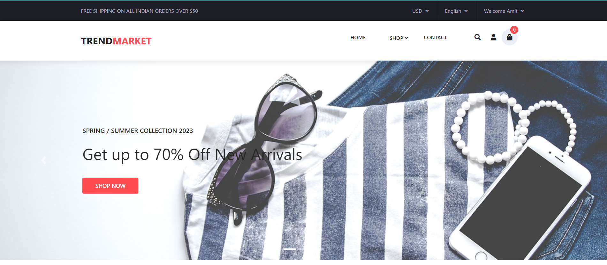
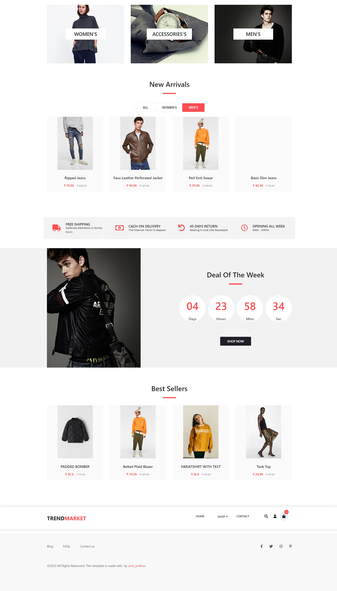
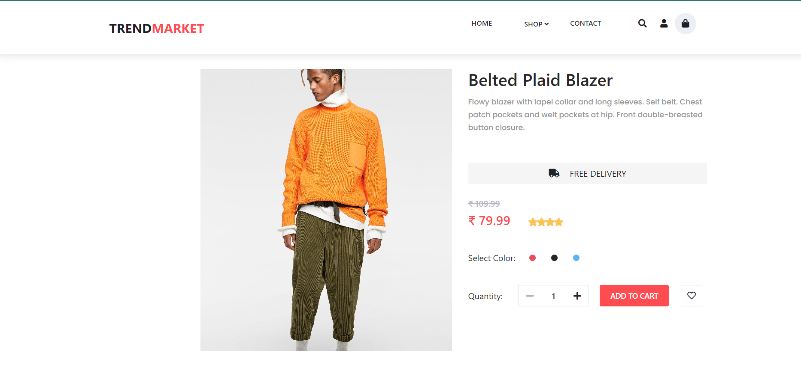
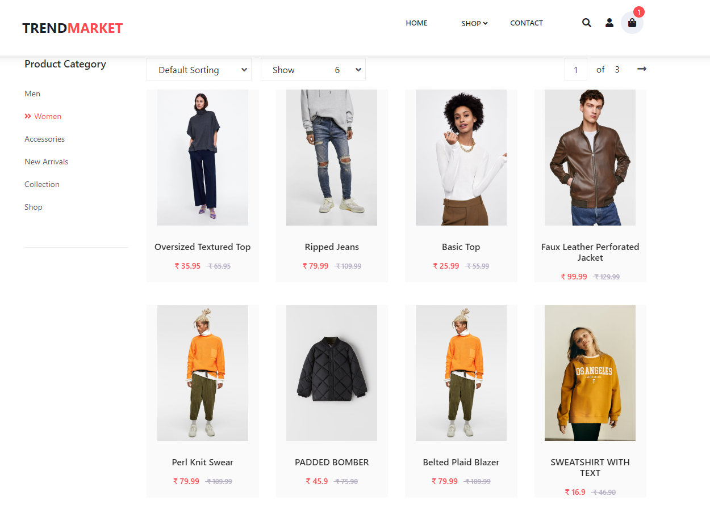
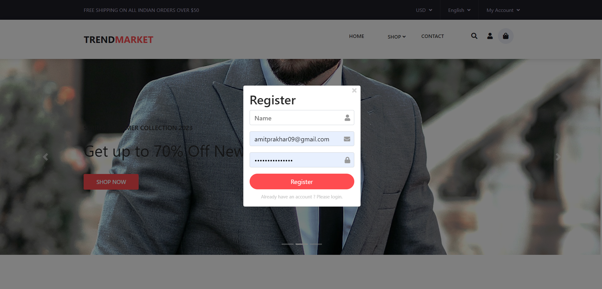
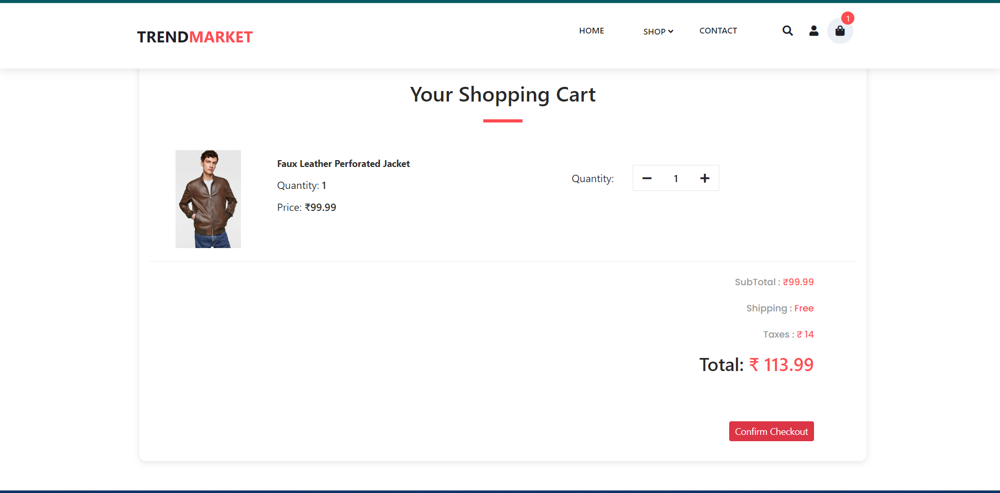
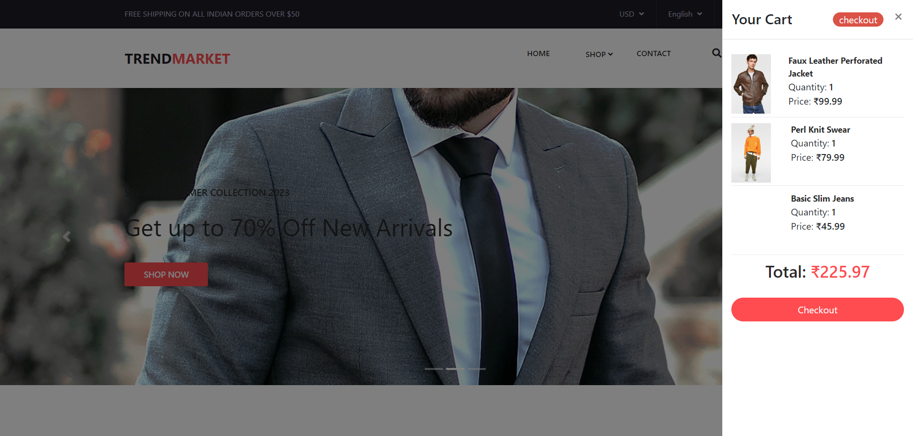

# Trend Market E-commerce Application

## General Info

This is an e-commerce application built using **ReactJS, Redux, Axios, and React-Bootstrap**. It allows users to browse and purchase products from various categories. The application provides features such as product listing, product details, product categories, recommended products, cart functionality, and user authentication.

[Live Demo](http://52.66.239.184:3001/trend-market)

## Technologies Used

- [x] Monorepo
- [x] Lerna
- [x] Design System
- [x] Hooks
- [x] Redux

## Key Features

-**Home:** Displays a list of products available for purchase.

-**Product Details:** Shows detailed information about a specific product.

-**Product Categories:** Allows users to browse products by category.

-**Recommended Products:** Suggests related products based on the user's browsing history.

-**Cart:** Enables users to add products to their shopping cart and proceed to checkout.

-**User Authentication:** Provides login and registration functionality for users.

## Future Enhancements

**-Payment Integration:** Enable secure online payment methods for users.

**-Wishlist:** Allow users to save products for future purchase.

**-Reviews and Ratings:** Allow users to rate and write reviews for products.

**-Order Tracking:** Provide order tracking functionality for users to monitor their shipments.

**-Social Sharing:** Enable users to share products on social media platforms.

Feel free to explore the live demo of the Trend Market E-commerce Application and experience its features firsthand.

# ScreenShot

